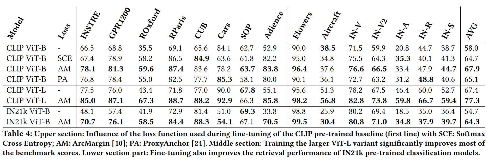

# Image-Encoders-for-GP-NNS
This is the official reposotory for the ICMR23 paper [Improving Image Encoders for General-Purpose Nearest Neighbor Search and Classification](https://doi.org/10.1145/3591106.3592266)

This paper investigates the effectiveness
of different vision foundation models on two challenging nearest
neighbor search-based tasks: zero-shot retrieval and k-NN classification. A benchmark for evaluating the performance of various
vision encoders and their pre-training methods is established, where
significant differences in the performance of these models are observed. Additionally, we propose a fine-tuning regime that improves
zero-shot retrieval and k-NN classification through training with a
combination of large publicly available datasets without specializing in any data domain. Our results show that the retrained vision
encoders have a higher degree of generalization across different
search-based tasks and can be used as general-purpose embedding
models for image retrieval.

CLIP pre-trained text-to-image models perform best in this benchmark. Their performance can further be significantly increased trough a general-purpose retrieval specific  fine-tuning:

# Environment
`pip install -r requirements.txt`

# Model Checkpoints
| Base Model        | GFLOPs/image | Fine-tuning Loss | Average Benchmark Score | Link |
|-------------------|--------------|-----------------|-------------------------|------|
| CLIP ViT-B/16@224 | ~20          | ArcMargin       | 67.9                    | [checkpoint](https://visual-computing.com/files/GPNNS/GPNNS_ViTB.pth)     |
| CLIP ViT-L/14@336 | ~180         | ArcMargin       | 77.3                    |   [checkpoint](https://visual-computing.com/files/GPNNS/GPNNS_ViTL.pth)   |

# Inference
An example on how to use our finetuned models for inference is shown in this [notebook](./notebooks/General-Purpose-Embedding%20ViT.ipynb)

# Evaluation
Coming Soon

# Fine-tuning
Coming Soon
